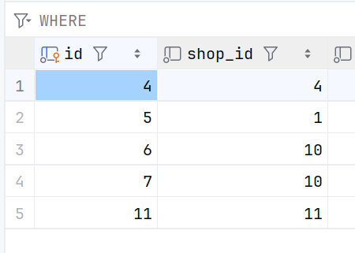

# [](https://)前置条件

## 什么语句会加锁？

当前读，还有增删改操作都会加锁
其中读操作又分为共享读和更新读。
select ... in share mode
select ... for update

## 行锁的种类有哪些？

Record Lock，记录锁，也就是仅仅把一条记录锁上；
Gap Lock，间隙锁，锁定一个范围，但是不包含记录本身；
Next-Key Lock：Record Lock + Gap Lock 的组合，锁定一个范围，并且锁定记录本身。通常是左开右闭的。

# Mysql行锁怎么加？

## 唯一索引等值查询

### 命中条件

举例：



**如果等值查询命中：`select * from XX where id = 5 for update`**

**

*锁住id=5这条记录* ❤️

### 没命中条件

**如果等值查询未命中：`select * from XX where id = 6 for update`**

**锁住（6，11）这个间隙** ❤️

## 唯一索引范围查询

### 大于

```select * from xxx where id > 7 ```
加锁情况

- 锁住(6,11] next-key lock ❤️
- (11,+∞] 这个next-key  ❤️

### 大于等于且命中

```select * from xxx where id >= 6```
加锁情况

- 锁住6这条记录 ️️️❤️
- 锁住(6,11]的间隙 next-key lock ❤️
- (11,+∞) 这个next-key  ❤️

### 小于不命中

```select * from xxx where id <7```
加锁情况

- 从1开始对每一条查询到的记录都加nextKey临建锁 ❤️
- (-∞,1],(1,2] (2,3] ... (5,6] nextKey lock ❤️
- 锁住(6,11)的间隙 gap lock ❤️ ️

### 小于等于且命中

```select * from xxx where id <=11```

- 所有都加上next-key lock
- (-∞,1],(1,2] (2,3] ... (5,6] ❤️

#### 总结：小于的时候只要最后一个记录不符合就退化，否则可以加next-key就加

## 非唯一索引等值查询


### 不命中

**二级索引有序扫描，当扫描到第一个不符合的记录时退化成间隙锁**
```select * from xxx where shop_id = 5```

因为索引直接定位到shop_id=5，发现不存在所以直接加间隙锁

- (4,10)的间隙锁 ❤️

**此时其他事务再插入shop_id=4或者10的时候，有可能会阻塞，有可能不会**
主要看主键ID，如果(id,shop_id)组合起来在间隙锁范围内，则阻塞，否则不阻塞。
例如上述条件中：插入(3,4)不阻塞，插入(6,4)阻塞

### 命中

```select * from xxx where shop_id = 4```

- (1,4]的nextKey ❤️
- (4,10)的gap lock ❤️ （是为了解决幻读问题）
- 锁住shop_id对应id的唯1索引的记录 record lock ❤️

**同理，能不能插入10或者4也是看id有没有在间隙锁范围内**
这个例子中对于shop_id=4这条记录，他左右两边都被间隙锁笼罩了，所以无法再插入，解决了幻读问题
对于shop_id=10这条记录，如果主键id<6，其他事务阻塞，如果主键id大于6可以插入。

## 非唯一索引范围查询

### 比较简单，二级索引全部都加next-key lock，主键索引对于记录加record lock
