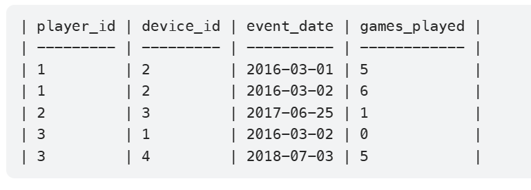

# leetcode基础50题练习总结

### 查询出玩家首次登录且第二天又登录了的玩家，在所有玩家中的比率。
先用函数查询id和第一天登录后的下一天日期
`select player_id, DATE_ADD(min(event_date),INTERVAL 1 day) as second_date
from Activity
group by player_id)`
然后用原表和子表连接查询出日期相等的id和日期 命名为Result表
最后直接查询去重后，Result和原表连接，查询出result表id的出现比率