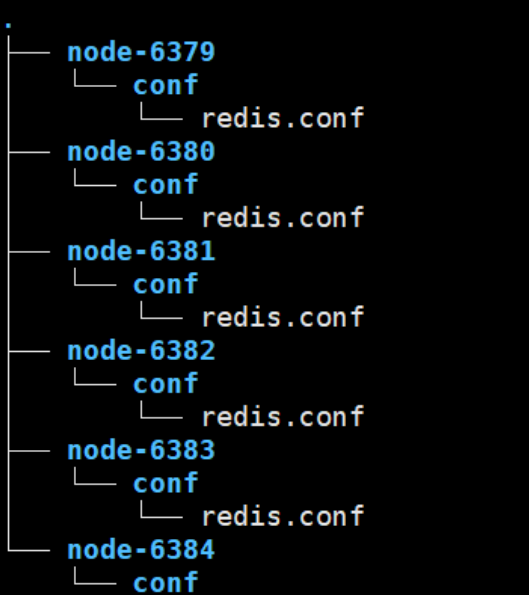
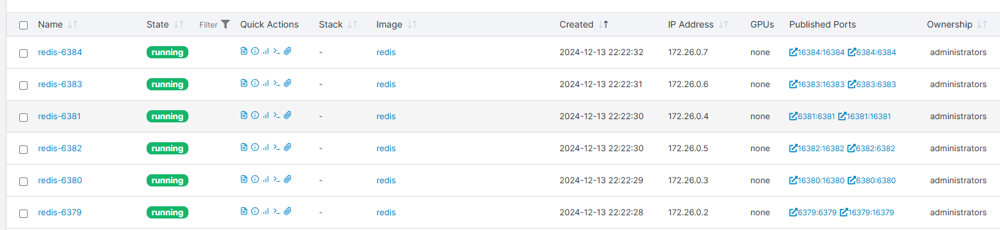
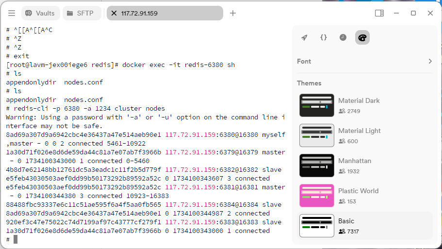
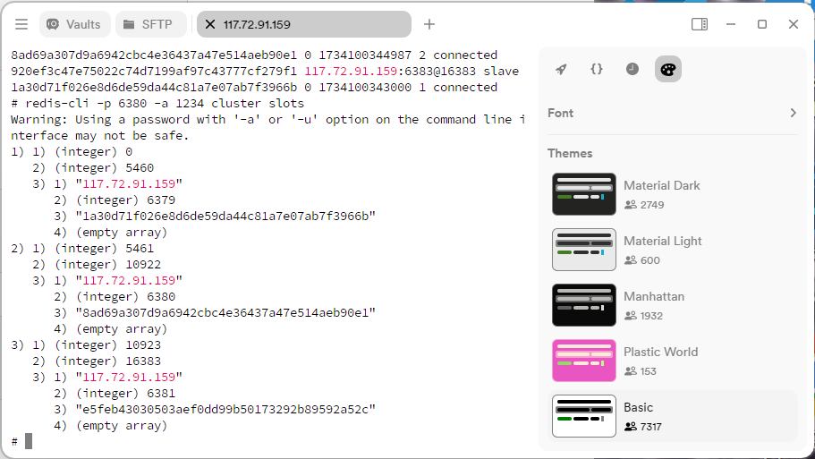
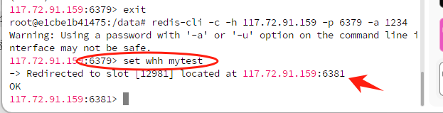

# 使用docker搭建redis-cluster集群

## 什么是redis-cluster？

redis-cluster是redis的分布式集群，它提供了自动分片的功能，可以将数据分片存储在多个节点上，从而提高了redis的性能和可用性。
举个例子：假设有6个redis节点，那么redis-cluster会将数据分片存储在这6个节点上，当有一个节点宕机时，redis-cluster会自动将宕机节点的数据迁移到其他节点上，从而保证数据的可用性。
如果我们链接到redis-cluster集群，那么我们可以通过任意一个节点来存储集群中的数据，redis-cluster会自动将请求转发到正确的节点上。

## 如何搭建redis-cluster？

### 1. 拉取镜像

```shell
docker pull redis
```

### 2. 创建docker网络

```shell
docker network create myredis 
```

### 3. 使用shell脚本编写配置文件

```shell
for port in $(seq 6379 6384); 
do 
mkdir -p /home/redis/node-${port}/conf
touch /home/redis/node-${port}/conf/redis.conf
cat  << EOF > /home/redis/node-${port}/conf/redis.conf
port ${port}
requirepass 1234
bind 0.0.0.0
protected-mode no
daemonize no
appendonly yes
cluster-enabled yes 
cluster-config-file nodes.conf
cluster-node-timeout 5000
cluster-announce-ip  服务器ip地址 #通常是宿主机的ip地址，也就是外网ip地址
cluster-announce-port ${port}
cluster-announce-bus-port 1${port}
EOF
done
```

tree命令可以查看目录结构

```shell
tree /home/redis
```



### 4. 循环创建redis容器

```shell
for port in $(seq 6379 6384); \
do \
   docker run -it -d -p ${port}:${port} -p 1${port}:1${port} \
  --privileged=true -v /home/redis/node-${port}/conf/redis.conf:/usr/local/etc/redis/redis.conf \
  --privileged=true -v /home/redis/node-${port}/data:/data \
  --restart always --name redis-${port} --net myredis \
  --sysctl net.core.somaxconn=1024 redis redis-server /usr/local/etc/redis/redis.conf
done
```


此时可以看到容器创建成功

### 5. 创建集群

```shell
docker exec -it redis-6379 /bin/bash
redis-cli  -a 1234 --cluster create 117.72.91.159:6379 117.72.91.159:6380 117.72.91.159:6381 117.72.91.159:6382 117.72.91.159:6383 117.72.91.159:6384   --cluster-replicas 1
```

创建成功！


### 6. 查看集群信息

```shell
docker exec -it redis-6379 /bin/bash
redis-cli -p 6380 -a 1234 cluster slots
```



### 7. 测试集群

可以看到，往其中一个里面添加，会自动路由到正确的节点上


**！注意：一定要开放6379-6384，并且16379-16384也要，本次实验的节点是通过外网进行连接的。（后续也可以改成内网的，但是不熟悉docker网络）**

## 总结

关键命令解释：

> redis-cli  -a 1234 --cluster create 117.72.91.159:6379 117.72.91.159:6380 117.72.91.159:6381 117.72.91.159:6382 117.72.91.159:6383 117.72.91.159:6384   --cluster-replicas 1

这个命令代表使用redis客户端，连接自己的redis集群，然后创建集群，集群的节点是6379-6384，--cluster-replicas 1代表每个主节点有一个从节点。前三个代表主节点


### 简介

本开发文档详细记录了OJ（Online Judge）系统的设计思路、技术选型、功能模块、实现细节以及后续优化方向。

OJ系统是一种用于编程比赛和算法训练的平台，主要功能包括：

1. **题目管理**：支持创建、修改、删除和分类题目，便于管理员灵活管理题库。
2. **用户管理**：提供用户注册、登录、权限管理功能，满足多角色需求（如管理员、参赛者）。
3. **评测系统**：支持提交代码自动判题，提供多语言支持（如 C++、Java、Python），实现快速、准确的代码评测。
4. **比赛管理**：支持编程比赛创建、题目分配、实时排名和结果统计。
5. **数据统计**：通过图表展示用户解题数据、评测通过率和其他平台运营数据。

#### 技术架构

* **前端**：使用 Vue.js 实现用户界面，提供友好且高效的交互体验。
* **后端**：基于 Spring Boot 框架，实现高性能 API 服务。
* **评测服务**：采用独立的沙盒技术（如 Docker）运行用户代码，确保系统安全性。
* **数据库**：使用 MySQL 存储核心数据，Redis 提供缓存支持，提升系统性能。

#### 项目目标

本系统旨在为程序员提供一个高效、公平的在线练习和比赛平台，培养用户的编程能力，同时为管理员提供便捷的管理工具，降低运营成本，提升用户体验。
