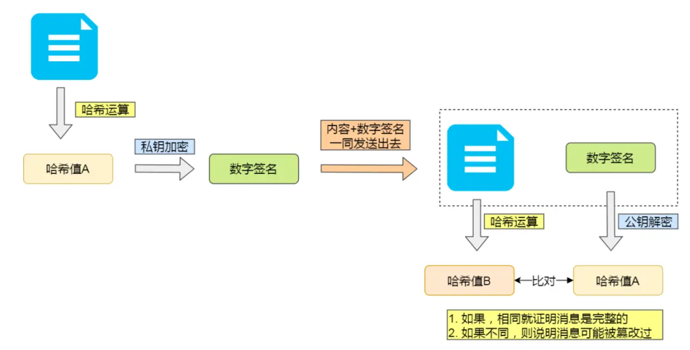

# HTTP是什么？

HTTP（超文本传输协议）
是负责在两个设备直接传输超文本数据的协议，基于tcp的

## 常见状态码

2xx 成功
3xx 重定向
4xx的代表客户端异常
401 登录验证被拒
403 权限不足
404 找不到文件资源
500 服务器笼统异常
502 服务器是正常的，但是代理转发出错
503 服务器在忙

## HTTP常见字段

Host主机,content-length报文长度,connection(keep-alive)默认长连接，content-type内容格式
content-encoding压缩方式

## GET和HOST的区别

Get一般不带请求体，post带请求体，其实本质上GET和POST没有区别。
但是一般语境下GET是幂等安全的，post不是

## 有了http，为什么还要rpc？

其实rpc并不是一个具体协议，而是**远程调用过程**，底层可以基于tcp，udp，甚至http，那么为什么还要有rpc？
其实是因为历史的原因，早期大家都用CS架构，那么各大公司不需要统一协议，就用自家的rpc框架，调用自家服务就好了。后期BS架构兴起的时候才用http
rpc比http1.1性能好多了，虽然http2出来之后性能http2更吊，但也懒得换了。

## 有了HTTP，为什么还要WebSocket？

http是半双工协议，无法主动给客户端发消息，就有了websocket，http到websocket会经历一次协议升级。
成功之后服务器就可以随时发消息给客户端了

## HTTP和HTTPS的区别。

http是不安全的，明文传输，https通过加入ssl协议加密传输
http连接简单，tcp握手后可以直接http握手，而https还要加入ssl握手
http端口80 https端口443
https还要想CA申请证书，证明你是安全的服务器

https解决了：**篡改，监听，冒充**问题

#### 混合加密：解决窃听问题

建立通讯前采用**非对称加密**，通信过程采用**对称加密**，保持安全和效率

#### 摘要算法+数字签名，解决篡改

发送端会对报文内容做一次Hash运算得到一个Hash值，如果服务器做同样的Hash运算得到相同的Hash值，说明内容没被改
但是，你怎么知道发送人一定是客户端，而不是伪造的假中间人？
这时候就要引入**非对称加密**算法来保证发送人是自己人。加密对象是Hash值，采用**私钥加密，公钥解密**的算法来验证发送的主体是谁

服务器端通过私钥加密，然后客户端通过公钥解密。得到两个哈希值。**数字签名其实就是这个Hash值**

但是，你怎么知道客户端的公钥不会被人替换呢？所以，需要引入数字证书

### 数字证书-解决中间人伪造公钥对

服务器需要将自己的公钥提供给CA验证机构，这样你的公钥就合法了，其他人也无法伪造，因为伪造出来的公钥对是不合法的。如果有中间服务器伪造了证书，那么浏览器会提示的

## HTTPS一定安全可靠吗

是的，协议很安全，黑客利用浏览器漏洞，那是浏览器的问题，不是协议的问题
